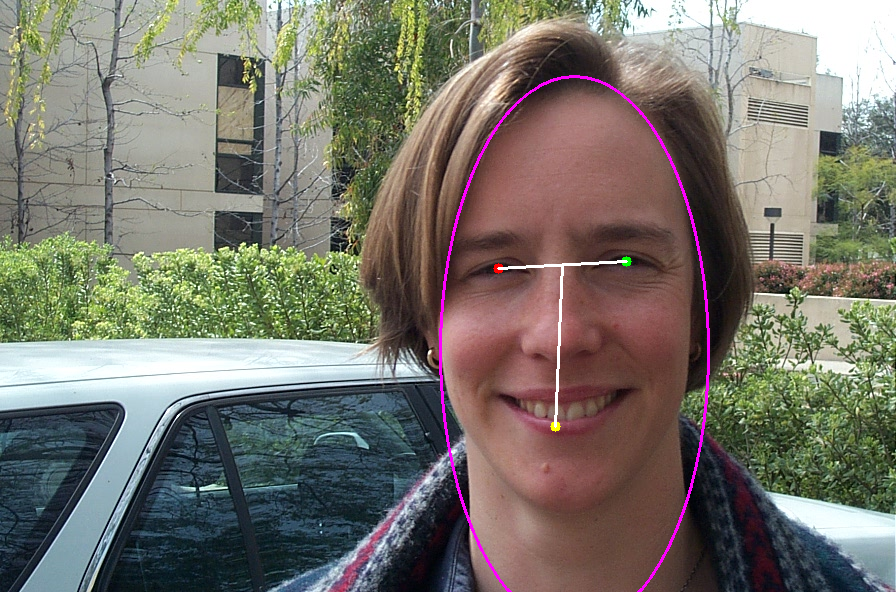

# Face Detection Based on Paper Reimplementation and Improvement

## Overview

This project implements a face detection pipeline inspired by the method proposed in:

> Ke-Jie Liao 廖科傑, "運用輪廓色彩和五官的人臉偵測技術 Face Detection by Outline, Color, and Facial Features", 2010.

The goal of this project is to reproduce the core idea of the original paper and further improve its performance under practical conditions such as illumination variation, complex backgrounds, and inaccurate candidate regions.

Compared with the original method, this implementation includes several modifications, including:

- replaced color-based skin filtering with Deep Learning method
- geometric validation for eye and mouth candidates

## Motivation

Face detection methods based on handcrafted features are sensitive to lighting conditions, skin color distribution, and background noise. Although the original paper provides a structured detection pipeline, some failure cases still occur in real images.

Therefore, this project aims to improve the robustness of the original method by integrating UNet for skin filtering and giving better geometric validation for eye and mouth candidates
.

## Features

- Skin region filtering
- Ellipse-based face candidate matching
- Eye and mouth candidate detection
- Geometry-based validation of facial landmarks
- Batch image processing with shell scripts
- Output visualization with detected eyes, mouth, and face ellipse

## Results example

| Original Image | Detection Result |
|---------------|----------------|
|  |  |
## Project Structure

```text
Face-Detection/
├── Face_detection.py
├── Face_detection_test.py
├── FaceDetection.sh
├── SkinFilter.sh
├── EllipseMatching.sh
├── TestImagesForPrograms/
├── FaceDetectionResults_new/
├── SKinFilterResults_new/
├── EllpiseMatchingResults1/
├── utilities/
├── scripts/
└── requirements.txt
