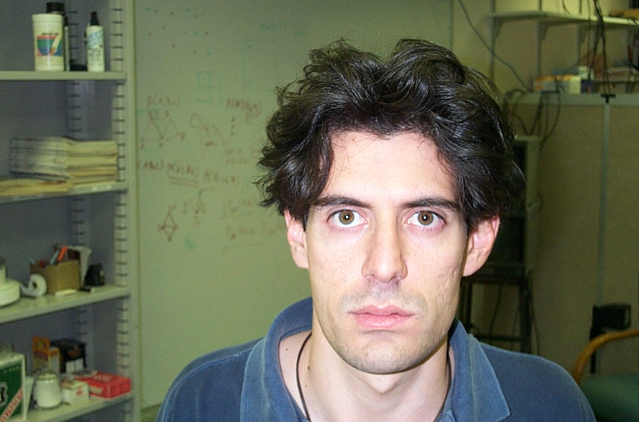
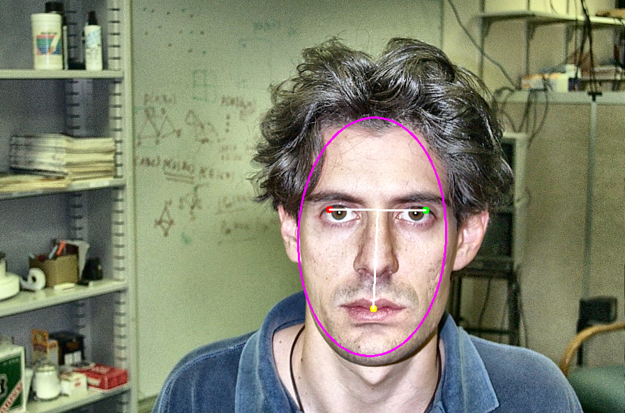

# Face Detection

A Python/OpenCV face detection project that uses skin filtering, ellipse matching, eye-map detection, mouth-map detection, and geometric validation to locate faces in images. This codespace is based on ["Face Detection by Outline, Color, and Facial Features"](https://tdr.lib.ntu.edu.tw/jspui/handle/123456789/47860).

## Features

- Skin region filtering
- Ellipse-based face candidate matching
- Eye and mouth candidate detection
- Geometry-based validation of facial landmarks
- Batch image processing with shell scripts
- Output visualization with detected eyes, mouth, and face ellipse

## Results example

| Original Image | Detection Result |
|---------------|----------------|
|  |  |
## Project Structure

```text
Face-Detection/
├── Face_detection.py
├── Face_detection_test.py
├── FaceDetection.sh
├── SkinFilter.sh
├── EllipseMatching.sh
├── TestImagesForPrograms/
├── FaceDetectionResults_new/
├── SKinFilterResults_new/
├── EllpiseMatchingResults1/
├── utilities/
├── scripts/
└── requirements.txt
